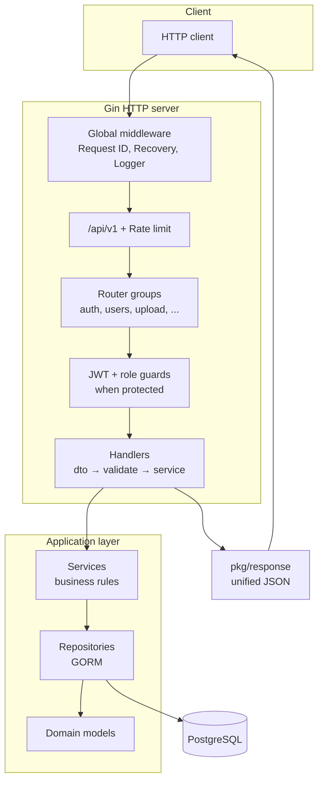

# Gin API template

Production-style Go + Gin backend: Postgres + GORM, SQL migrations, JWT, bcrypt, modular handlers (DTO + presenter per feature), unified JSON responses, rate limiting, Swagger UI, CI.

**Module path:** `gin-api` (see `go.mod`). To use a GitHub path later, change the `module` line and replace imports project-wide.

| Doc | Purpose |
|-----|---------|
| **This README** | Features, install, architecture at a glance, tech stack, contributing. |
| [Learning.md](Learning.md) | File-by-file reading order, request/runtime flow, how to add a feature. |
| [EXPLAINER.md](EXPLAINER.md) | Same ideas in very plain language. |
| [ARCHITECTURE.md](ARCHITECTURE.md) | Deeper layout, scaling, security, commands. |
| [CONTRIBUTING.md](CONTRIBUTING.md) | How to contribute. |

---

## 🚀 Features

- **HTTP API** on **Gin** with versioned routes (`/api/v1`)
- **PostgreSQL** with **GORM** and **SQL migrations** (golang-migrate) as schema source of truth
- **Auth:** registration/login, **bcrypt** passwords, **JWT** access tokens, role helpers (e.g. admin-only routes)
- **Consistent JSON** envelope for every response (`success`, `message`, `status_code`, `data`)
- **Cross-cutting middleware:** request ID, panic recovery, per-IP **rate limiting** on the API group
- **Swagger / OpenAPI** UI and generated specs (`make swagger`)
- **Health** endpoints (liveness / readiness)
- **Example modules:** user profile, multipart **upload**, admin ping
- **CI** (GitHub Actions): Postgres service, migrate, `go test`

---

## 🏗 Architecture diagram

High-level request flow:



Dependency wiring (startup): **`cmd/api/main.go`** → **`internal/config`** → **`internal/app`** builds repositories, services, handlers, then **`internal/router`** mounts routes. See [Learning.md](Learning.md) for a file-by-file walkthrough.

---

## 📦 Installation steps

1. **Prerequisites:** [Go](https://go.dev/) 1.23+, [Docker](https://docs.docker.com/get-docker/) (for local Postgres), [golang-migrate](https://github.com/golang-migrate/migrate) CLI.

2. **Clone and env:**
   ```bash
   cp .env.example .env
   ```
   On Windows: `copy .env.example .env`  
   Set `DATABASE_URL` and `JWT_SECRET` (minimum 32 characters). See `.env.example` for other variables.

3. **Database:**
   ```bash
   docker compose up -d postgres
   migrate -path migrations -database "$DATABASE_URL" up
   ```
   PowerShell: set `$env:DATABASE_URL` first, then run `migrate` with the same URL.

4. **Run the API:**
   ```bash
   go run ./cmd/api
   ```

5. **Verify:**
   - Swagger UI: `http://localhost:8080/swagger/index.html` (port from `HTTP_PORT` in `.env`)
   - After changing `// @Summary` / `// @Router` on handlers: `make swagger`

Useful commands are in the [Makefile](Makefile) (`make run`, `make test`, `make swagger`, migrate helpers).

---

## 🔥 Why this template?

- **Batteries included:** Auth, health checks, uploads, admin example, CI, and OpenAPI—enough to ship a real service without assembling glue from scratch.
- **Explicit schema:** Migrations own the database shape; GORM maps to it. Reviews and rollbacks stay clear.
- **Teachable structure:** Vertical slices (`dto` / `presenter` / `handler` per feature) plus a single wiring point in `internal/app` make onboarding predictable.
- **Production-minded defaults:** Unified errors, validation, rate limits, and secure password handling—without locking you into a heavy framework.

---

## 🛠 Tech stack

| Area | Choice |
|------|--------|
| Language | Go 1.23 |
| HTTP | [Gin](https://github.com/gin-gonic/gin) |
| Database | PostgreSQL, [GORM](https://gorm.io/), [golang-migrate](https://github.com/golang-migrate/migrate) |
| Auth | [JWT](https://github.com/golang-jwt/jwt), bcrypt ([golang.org/x/crypto](https://pkg.go.dev/golang.org/x/crypto/bcrypt)) |
| Validation | [go-playground/validator](https://github.com/go-playground/validator) |
| API docs | [swaggo/swag](https://github.com/swaggo/swag), gin-swagger |
| Config | Environment + `.env` via [godotenv](https://github.com/joho/godotenv) (local) |

Full dependency versions are in [`go.mod`](go.mod).

---

## 🤝 Contribution guide

See **[CONTRIBUTING.md](CONTRIBUTING.md)** for issue and PR expectations, tests, migrations, and documentation updates.
